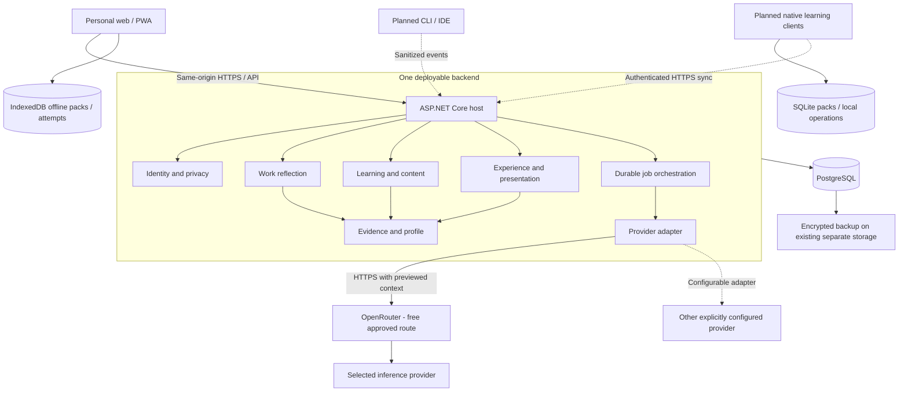

# Architecture and material alternatives

## Recommended system

The creator's confirmed proficiency includes ASP.NET Core microservices, RabbitMQ and PostgreSQL. Recommendations should be justified by product boundaries and operational needs, not presumed inexperience. The revised delivery model includes required offline learning plus planned native, CLI/IDE and organization tracks; see [offline clients and expansion](08-offline-clients-and-expansion.md).

Use **ASP.NET Core 10 / EF Core 10 / Npgsql EF provider 10, PostgreSQL 18, and a React 19.2 + TypeScript + Vite 8.3 client**. Serve the built client and HTTP API from the same origin. Use one backend process containing a bounded background worker, with durable work in PostgreSQL. **Initially run the application/database on the developer's machine; use free external inference through a configurable server-side adapter.** No Node server is needed in the packaged application.

.NET 10 is LTS through 14 November 2028; the retrieved support table lists 10.0.12. PostgreSQL 18 is supported through 14 November 2030; the retrieved table lists 18.6. Npgsql publishes its EF provider 10 release. Pin a compatible, supported patch set when implementation begins, rather than treating this research document as a lockfile. [Microsoft support policy](https://dotnet.microsoft.com/en-us/platform/support/policy), [PostgreSQL version policy](https://www.postgresql.org/support/versioning/), [Npgsql EF 10](https://www.npgsql.org/efcore/release-notes/10.0.html).

React documentation identifies 19.2; Vite identifies 8.3 as its regular-patch branch. Use Node 24 LTS for building and CI, and a stable compatible TypeScript version pinned at M0. Exact npm patches remain an implementation-time check. [React versions](https://react.dev/versions), [Vite support](https://vite.dev/releases), [Node releases](https://nodejs.org/en/about/previous-releases).

Arrows between modules denote application contracts, not network calls or permission to write another module's tables. Runtime processing is described in [lifecycles](02-domain-and-lifecycles.md).

## Enforceable domain boundaries

| Module | Owns | Public operations / consumes |
| --- | --- | --- |
| Identity and privacy | User, credentials, locale, privacy settings, export/deletion requests | Current owner context; authorize resource use; orchestrate deletion across modules |
| Learning and content | Concepts, curated scenario versions, rubrics, learning sessions, review plans | Start independent learning; choose variant; schedule from evidence |
| Work reflection | Episodes, context snapshots, interpretation revisions, reflection sessions, acknowledgements | Correct context; ask bounded questions; summarize review; request journal draft |
| Evidence and profile | Evidence observations, classification revisions, profile projection | Record narrow observations; expose provenance; rebuild derived views |
| Experience and presentation | Journal revisions, contribution/impact claims, approved artifact revisions | Create manually or from reflection; approve facts; generate grounded story |
| Infrastructure | Database mapping, AI adapters, durable jobs, metrics, clocks | Technical capabilities called by application services; no domain authority |

Keep Knowledge/Competency and Professional Profile in the same module initially: evidence is the durable input, competency views are projections. A separate inference service would add little. Keep career presentation within Experience until actual interview planning deserves a separate module. Add an Organizations module in the expansion track for membership, curated team content and explicit revision-level sharing; personal records retain individual ownership. Client Sync owns operation receipts, change cursors and device registrations, while domain services authorize/apply each allowed command.

Suggested source organization: API host; optional worker host; separate module assemblies with internal domain/application implementations and explicit public contracts; infrastructure adapters; client sync/policy contracts; web, native and CLI clients; focused tests. This is a proposed layout, not scaffolded code. Keep one backend EF unit of work for the first transactional core, with table/schema ownership and mapping grouped by module. This intentionally permits atomic cross-module source/evidence updates; separate DbContexts/services later only with explicit outbox/projection consistency semantics. Application code writes through owning module services. Architecture tests enforce dependencies; avoid assembly multiplication without an actual boundary.

Shared primitives should be limited to identifiers, owner context, clock, optimistic concurrency, typed errors and integration contracts. Share low-level session record structures where useful, but retain distinct Learning and Reflection policies. Avoid one universal workflow engine or a giant chat domain.

## Transactions, events and durable work

Use direct application commands for operations whose success the caller must know. Within one transaction, save the answer and its AI job; after validation, save feedback, observations and review updates together through module services. Synchronous in-process notifications can describe `AttemptAssessed`, `ExperienceRevisionApproved`, and `FeedbackSuperseded`. Their handlers run before commit or the transaction rolls back. Publish no required side effect only in memory after commit.

Model-derived experience drafting is a persisted job requested separately, never a side effect that silently approves a claim. Write asynchronous work requests in the same database transaction as their cause. This job table is an outbox-like reliability boundary from the first AI slice. It is not event sourcing: current aggregates and immutable revisions remain the source of truth. RabbitMQ becomes appropriate when independent integration/notification/projection consumers require fan-out and backpressure; the expansion design specifies transactional outbox, consumer deduplication and explicit projection lag rather than distributing existing transactions implicitly.

## Decision comparison

| Decision | Recommendation and reason | Credible alternative / switch trigger |
| --- | --- | --- |
| Backend | .NET 10 monolith matches expertise and transactional workflow | Node/Python backend adds language/hosting overhead without a required capability; isolate a specialized component only after measurement |
| UI | React SPA: explicit HTTP recovery, structured forms, transcript/editor interactions, future API clients | Blazor is credible if C# UI productivity is substantially better; server interactivity depends on a circuit, while WebAssembly adds browser download/runtime concerns. Run a small UI spike only if this is uncertain. [Blazor hosting](https://learn.microsoft.com/en-us/aspnet/core/blazor/hosting-models?view=aspnetcore-10.0) |
| SSR / Next.js | Defer: private authenticated screens have no baseline SEO requirement | Add a separate marketing site later; no reason to duplicate the authoritative backend |
| SQL | PostgreSQL with EF Core for authoritative backend data; SQLite for native offline storage; IndexedDB for PWA data | Client stores use deliberate sync contracts, not replicated backend tables; SQL Server offers no requirement-driven advantage here |
| Jobs | Small PostgreSQL `AiJob` table and `BackgroundService`, tightly limited to known operations | Hangfire gives a dashboard, retries and scheduling, but adds scheduler state and a community PostgreSQL adapter. Adopt if operational job breadth outweighs owning a small lease loop; still retain domain idempotency. [Hangfire](https://www.hangfire.io/overview.html), [PostgreSQL adapter](https://github.com/hangfire-postgres/Hangfire.PostgreSql) |
| Client updates | Durable device storage and push/pull synchronization; poll online job state with backoff | SSE/SignalR can deliver online change notifications when useful; neither replaces offline synchronization or durable job recovery |
| AI abstraction | Domain task interfaces over a narrow provider adapter | `Microsoft.Extensions.AI` supplies `IChatClient`; use internally if it preserves required schema/usage/privacy controls. Do not require Semantic Kernel or autonomous agents for a bounded sequence. [Microsoft AI abstractions](https://learn.microsoft.com/en-us/dotnet/ai/microsoft-extensions-ai) |
| Search | Owner-filtered tags, dates and full-text journal search | Add pgvector only if a representative retrieval evaluation shows useful misses from lexical/concept search; do not embed everything preemptively |
| AI provider | OpenRouter adapter and explicitly selected free model/endpoint; inspect capabilities and apply a zero-price ceiling | Another provider adapter is configuration-compatible after the same contract/evaluation checks; no automatic paid downgrade or upgrade |
| Infrastructure | Local ASP.NET and PostgreSQL; free external inference; no paid services | One Linux VM or managed application when hosting is authorized; free quota remains independent of where the app runs |

Choosing a custom job table entails real responsibility for leases, retry limits, fencing and crash tests. If the M1 recovery spike fails, switch to a maintained scheduler rather than expanding a home-grown queue framework.

## Storage and API shape

Relational columns and foreign keys hold ownership, versions, statuses, approvals, concept references and dates. Use JSONB for schema-versioned assessment details and task options; validate before insertion. Do not store the whole domain in an opaque JSON transcript. Keep original answers and separate revisions; profile summaries are reproducible queries/projections.

Text-only source snapshots and outputs fit PostgreSQL under input limits. Baseline has no attachment upload, repository clone, audio store or vector database. Use GIN-indexed `tsvector` over approved journal text, retaining owner filters and language configuration; code identifiers can use simple tokenization. [PostgreSQL text search indexes](https://www.postgresql.org/docs/18/textsearch-indexes.html).

Use `/api/v1` JSON endpoints, generated OpenAPI, Problem Details, pagination, UTC instants plus user timezone, opaque IDs and version tokens. Every modifying request validates ownership server-side. Future clients use the same domain operations but can have different screens and authentication adapters. The client never receives database entities or model credentials.

## Licensing and maintenance

ASP.NET Core and React publish MIT licenses; PostgreSQL and Npgsql publish permissive licenses requiring preservation of notices. Hangfire offers LGPLv3 or commercial terms, and its PostgreSQL adapter declares LGPLv3. These are license facts, not a conclusion about all distribution obligations. Record the actual dependency/transitive license inventory when packages are chosen. No paid Hangfire feature is required here. [ASP.NET Core license](https://github.com/dotnet/aspnetcore/blob/main/LICENSE.txt), [React license](https://github.com/facebook/react/blob/main/LICENSE), [PostgreSQL license](https://www.postgresql.org/about/licence/), [Npgsql license](https://github.com/npgsql/npgsql/blob/main/LICENSE), [Hangfire license](https://github.com/HangfireIO/Hangfire/blob/main/LICENSE.md), [adapter license](https://github.com/hangfire-postgres/Hangfire.PostgreSql).

Free inference is a service offering, not a blanket license or a guarantee of continued access. Record model/provider terms with the selected route; no model weights are redistributed by the prototype. Docker Desktop permits personal and educational use without a paid subscription under its stated terms; native PostgreSQL is an alternative, so Docker is not a mandatory commercial dependency. [Docker terms](https://docs.docker.com/subscription-billing/desktop-license/).

At implementation, commit lockfiles and SDK pins, use supported base images, retain notices for libraries and curated sources, and schedule ordinary patch review. Avoid a UI component suite with a paid runtime requirement. Use existing hardware and storage; local electricity/storage consumption is real, but there is no mandatory service bill.
