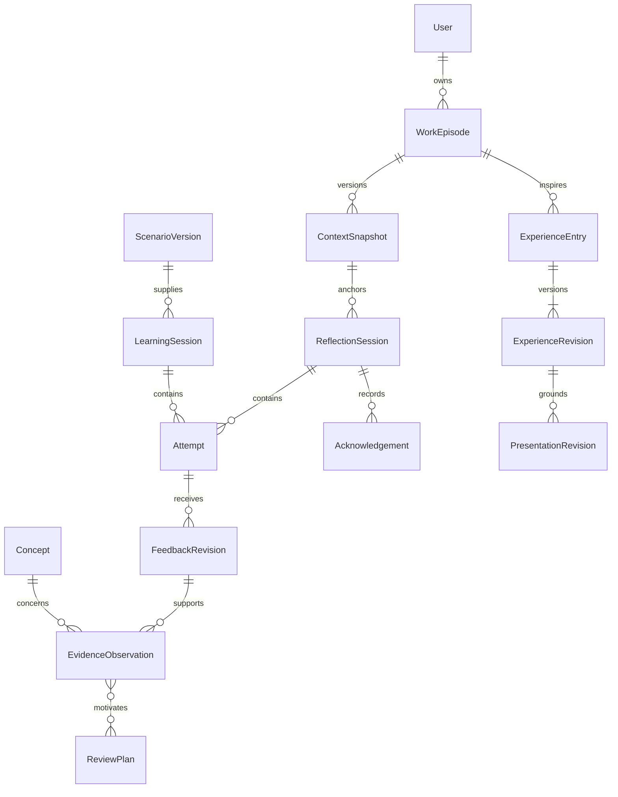

# Domain, provenance and lifecycles

## Facts, claims and interpretations

A fact that an answer was submitted is durable; the truth of that answer is not established by storing it. Likewise, approval establishes that the user confirmed an account, not that employment or impact was externally verified. Model output is an attributed interpretation. Profile indicators are derived views over those records.

Offline learning adds device-local durable facts before the backend receives them. `LearningPackVersion`, `DeviceRegistration`, `ClientOperation`, `SyncReceipt`, `ChangeCursor` and deletion tombstones support the protocol in [offline clients](08-offline-clients-and-expansion.md). Store device-recorded time separately from server receipt time and `self_reviewed`/`deterministic_check` separately from model assessment. The backend still authorizes all synchronized writes; local persistence is not server acknowledgement or approval.

Learning and journal entry creation do not require a work episode. The diagram summarizes relationships; it does not prescribe a table per noun or permit dangling polymorphic references.

## Conceptual records

| Record | Essential fields and responsibility |
| --- | --- |
| User / Goal | Stable individual ID, UI locale, answer-language preference, timezone, optional learning/career goals; no required employer |
| Concept / ScenarioVersion | Stable concept key, aliases, a few prerequisite links; immutable scenario/rubric/reference versions, difficulty and locale |
| WorkEpisode | Owner, title, setting (`employment`, `coursework`, `personal_project`, `other`), event date, user role; mutable working draft |
| ContextSnapshot | Owner, episode, sequential version, selected text/excerpts, source kind, fingerprint, disclosure manifest, created time; immutable once submitted |
| InterpretationRevision | Snapshot ID, proposed intent/constraints/missing information, origin, user corrections and accepted revision ID |
| Session | Kind-specific policy; owner, immutable input/scenario version, accepted interpretation, bounded question plan, lifecycle and concurrency version |
| Question / Attempt / HintUse | Concept/aspect and rubric version; exact question; answer with ordinal and previous-attempt link; separate hint/explanation reveal events and assistance disclosure |
| FeedbackRevision / Dispute | Attempt, criterion-level observation, context sufficiency, technical result, communication advice, model uncertainty, reference IDs, job provenance; dispute and supersession links |
| Acknowledgement | Owner action, session ID, snapshot fingerprint, accepted interpretation, reviewed feedback-set version, checked topics, unresolved/disputed items and explicit timestamp |
| EvidenceObservation | Owner, concept/aspect, signal kind, source version, assistance, conditions, assessment provenance, status (`active`, `disputed`, `superseded`, `withdrawn`) |
| ReviewPlan / ReviewOccurrence | Owner, concept/aspect, exercise family, evidence reasons, policy version, stage, due time, snooze/pause status; completed occurrences point to actual attempts |
| ExperienceEntry / Revision | Stable entry ID; versioned context, role, actions, alternatives, contribution attribution, outcome, impact state, concepts, provenance and factual approval |
| PresentationRevision | Exact approved experience revision, selected facts, generated/edited text, format, approval state and export timestamp; never joins private attempts on export |
| AiJob / AiInvocation | Logical operation and immutable input versions, status, limits, lease, cancellation generation; individual inference attempts, model/runtime/template/schema digests and usage |

Use owner-scoped composite foreign keys where practical: `(OwnerId, AttemptId)` must resolve to the same owner's attempt. Evidence can have nullable typed foreign keys to an attempt/feedback revision, approved journal revision or declaration, with a CHECK requiring exactly one source category. Avoid a free-form `SourceType + SourceId` pair with no referential validation. A `SourceLink` relation tracks additional dependencies needed for deletion and artifact invalidation.

## Evidence policy

| Input | Evidence created | Forbidden inference |
| --- | --- | --- |
| User declares familiarity | Dated self-declaration | Assessed knowledge |
| Approved entry mentions DI | Exposure and user-confirmed contribution claim | Understanding DI or thread safety |
| Valid assessment of an unaided explanation | Observation for that concept/aspect under those conditions | Mastery of all .NET |
| Corrected answer after teaching | Assisted learning observation linked to first attempt | Independent success replacing the first attempt |
| Successful changed scenario later | New transfer observation with its scenario conditions | Certified competence or proven lack of outside assistance |
| Timeout, skipped/irrelevant question, disputed verdict | Operational state or unresolved record | Failed understanding |

Profile views show declarations, usage history, explanation/scenario observations, assistance, unresolved questions and refresh candidates separately. A narrow claim might read: “Explained scoped-service creation in two scenarios; one later attempt unaided; thread-safety evidence unresolved.” Show supporting records and dates. Do not compute a universal percentage. Recency affects practice priority, not the historical truth of an observation. Store model uncertainty and user confidence independently; a model's self-reported confidence is not a calibrated probability.

Classification corrections append a revision and withdraw the old classification from active views. Original data remains inspectable until deletion. Journal approval can add exposure without modifying learning evidence; a disputed assessment is excluded from automatic knowledge conclusions until resolved.

## Lifecycles

| Object | States and transitions | Guard |
| --- | --- | --- |
| Reflection session | `Draft → ContextConfirmed → Active → ReviewReady → Closed`; pause/resume from confirmed/active/review; abandon explicitly | Close reason is `acknowledged`, `finished_without_acknowledgement`, or `abandoned`; unanswered questions remain visible |
| Learning session | `Created → Teaching/Attempting → FeedbackReady → Completed`; pause/resume; incomplete exit allowed | Provider job status is independent; completion can include skipped or assisted work |
| Job | `Queued → Running → Succeeded`; transient fault → `RetryScheduled → Running`; `Failed`, `Cancelled`, `Obsolete` terminal | Persist input first; no assessment evidence on operational failure |
| Client operation | `PendingLocal → Sending → Accepted`; disconnect → `PendingLocal`; conflicts/rejections retain a receipt and a recoverable local record | Atomically save input and operation; retry same operation ID; deletion wins over stale updates |
| Offline pack | `Downloading → Verified → Active`; incomplete downloads remain staged; versions become superseded | Activate all required assets atomically; unsynced attempts retain exact rubric/content version |
| Feedback correction | Original revision → dispute open → context clarified / revised assessment / unresolved | New revision has `SupersedesId`; never overwrite the answer or automatically treat the user's objection as correct |
| Acknowledgement currency | Current only for its exact review bundle; becomes context-outdated, review-updated, withdrawn or source-unavailable | Currency is derived relative to current input/review, not an editable “approved=true” bit |
| Experience revision | `Draft → Approved`; revision of approved entry starts a new `Draft`; retract approval explicitly | Approval applies to exact field values; old approved revision remains historical |
| Presentation revision | `Draft → Reviewed → Exported`; edits create a new draft | Export requires an approved source revision and explicit artifact review; export bytes represent that version |
| Practice | `Suggested → Scheduled → Due → InProgress → Completed`; snooze, pause, dismiss available | Completion refers to a saved attempt; operational failures preserve due work, and restart does not create duplicate reviews |

For feedback corrected after acknowledgement, retain the acknowledgement as a record of what was seen. Display “feedback revised since acknowledgement”; any new acknowledgement reviews a new bundle. An assessment/prompt update never retroactively upgrades a past acknowledgement.

## Context versions and acknowledgement races

For web input, compute a source fingerprint using SHA-256 server-side over a versioned, length-delimited canonical envelope: source kind, ordered selected excerpts, declared intent/constraints and source version labels. UTF-8 and stable serialization are specified; normalize transport line endings consistently but do not remove whitespace from code, reorder excerpts or drop comments. Snapshot identity alone is also retained. The hash identifies exactly supplied context, not repository truth, completeness or comprehension.

Compute a separate review-bundle fingerprint from that immutable source fingerprint, accepted interpretation revision, question/attempt versions and displayed feedback-set version. Interpretation and feedback arise after snapshot creation, so they must not mutate the source fingerprint. Correcting source intent/constraints creates a new source snapshot; merely revising the application's interpretation creates a new review bundle.

Conservatively create a new snapshot for **any** changed assessed text or constraints; no model decides whether a change is material. Harmless cosmetic changes can cause rechecks, an acceptable prototype trade-off. Changing a journal title alone does not alter a source snapshot.

Acknowledgement command includes snapshot ID, review-bundle version and expected session version. In one transaction lock/check the relevant session and episode current version, verify ownership and that the displayed bundle is still current, then insert the acknowledgement. Context edits use the same concurrency boundary. A racing stale request gets `409 Conflict` and a reload, not approval of the newer snapshot. A repeat with the same idempotency key returns the original acknowledgement. A user can still explicitly acknowledge an older snapshot from its historical view, labeled as historical only.

Draft entry approval and artifact export use equivalent expected-version guards. UI disabling alone is insufficient. Approval with unresolved questions is allowed and records them; missing feedback cannot be represented as assessed.

## Reliable inference without losing answers

1. `POST attempt` validates owner and expected session version. Commit immutable answer, hint-use references and queued job in one transaction. Return attempt/job IDs immediately; replaying the same owner-scoped idempotency key returns those IDs. Reusing the key with another body is a conflict.
2. Worker claims due jobs using a short transaction and row lock, sets lease owner/expiry and increments a fencing token. PostgreSQL documents `SKIP LOCKED` for queue-like consumers. Commit before inference; never hold a database transaction across a model call. [PostgreSQL SELECT locking](https://www.postgresql.org/docs/18/sql-select.html).
3. Load the exact input versions and provider configuration revision; verify source still exists, permission/disclosure still holds, the route remains free and session generation matches. Heartbeat a lease during long inference. Start with one inference at a time and an account-wide quota reservation.
4. Call the configured adapter with bounded context/output and deadline. Persist an invocation record, including actual model/upstream provider when returned. Validate the result; then in one transaction recheck fencing token, cancellation generation, source availability and expected input version before saving feedback, evidence and dependent review changes.
5. Use uniqueness on logical result keys: `(JobId, ResultKind)`, `(SourceRevisionId, ConceptId, Aspect, SignalKind)` and active review-plan identity. New deliberate assessments receive new logical job IDs and supersede old revisions. A retry cannot duplicate an achievement or observation.

Initial policy: one retry for transient provider failure with backoff; one bounded schema repair if needed; maximum three inference invocations total per logical job, including repair. Respect `Retry-After`; exhausted daily quota pauses jobs until reset or explicit retry rather than burning retries. Permanent schema/input errors require correction. Model unavailability is recoverable status. An HTTP disconnect does not cancel durable work; explicit cancel invalidates the fencing/generation token. Best-effort inference cancellation may save resources, but only database guards prevent late writes.

If the worker crashes after inference but before commit, computation may repeat. This is at-least-once execution with idempotent domain effects, not exactly-once inference. Expired leases recover after restart. A lost lease cannot commit even if the old worker later returns. Delete/cancel invalidates queued and running work so removed text cannot reappear through delayed results.

An internal jobs screen exposes state, timestamps and safe error categories for recovery; it need not reveal answers or full prompts. A scheduler replacement must preserve these domain invariants.
