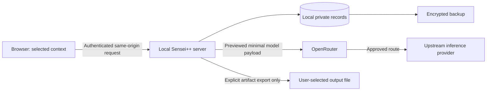

# Security, privacy and data ownership

## Trust boundaries

The prototype's application and PostgreSQL run locally, but AI request content crosses two external boundaries: **OpenRouter and the selected model-serving provider**. Account credentials, source context, answers and journal entries need different handling. A developer owning their learning history does not thereby gain permission to share employer intellectual property.

## Route policy and practical prototype boundary

The initial live demo uses curated/public/synthetic material and nonpersonal technical answers. Private journal capture stays useful without model processing. Do not market a free demonstration route as suitable for confidential employer code.

OpenRouter's privacy policy distinguishes its handling from downstream model-provider handling. Disabling router prompt logging does not establish that an upstream provider neither stores nor trains on the request. Record policy URLs/check dates and disclose recipients before submission. [OpenRouter privacy policy](https://openrouter.ai/privacy).

The selected Nemotron free candidate explicitly warns against confidential/personal input and describes logging. Therefore it is a **public-example route only**, subject to the user's deliberate configuration and preview acceptance; it is not eligible for restricted-data sessions. No live request or acceptance of these terms has occurred in this research phase. [Endpoint restrictions](https://openrouter.ai/nvidia/nemotron-3.5-lightning:free).

For later restricted-data routes, require compatible upstream data policies and, when the deployment promises it, ZDR routing. OpenRouter provides endpoint filtering for ZDR; this is a provider-policy constraint, not a claim that the application can independently prove downstream deletion. An empty eligible route set must stop processing. Do not relax privacy to keep a free model working. [OpenRouter ZDR](https://openrouter.ai/docs/guides/features/zdr).

If no acceptable free route exists for a real episode, the user can save it locally, remove sensitive details, use a general curated scenario, and draft/reuse their account manually. Free services remain optional enrichments to durable user data. Downloaded offline learning is required and uses authored guidance and local records; new external AI assessment needs connectivity. See [offline privacy and sync](08-offline-clients-and-expansion.md).

## Controls by risk

| Risk | Concrete control and test |
| --- | --- |
| Cross-user record access | Owner derived from authenticated principal on every read/write, search, job, export and source lookup; owner-scoped FK/unique constraints; two-user negative tests |
| Password/session misuse | ASP.NET Core Identity, password hashing/lockout, secure HttpOnly cookie, antiforgery for state-changing requests; no access token in browser localStorage |
| Local service exposure | Bind prototype app/database to loopback; development proxy preserves same-origin behavior; no public tunnel required |
| Future hosted exposure | HTTPS, secure cookies, exact allowed origins, host validation, rate limits, persisted encrypted data-protection keys; private database network |
| Prompt injection | Code/comments/answers are task data; no executable tools, permission changes, model-selected URLs, arbitrary retrieval or publication paths; validate IDs and output constraints |
| Browser injection | Escape code/Markdown, sanitize rendered HTML, disallow raw scripts and unsafe links; CSP; no sensitive third-party analytics or session recording |
| Sensitive submission | Before save/send, explain local retention and external payload separately; show exact excerpts/answers and recipients; client/server secret-pattern checks and manual redaction |
| Credential leak | Provider keys only server-side secret references, redacted errors/headers; keys excluded from AI payloads, logs, exports and source control |
| SSRF through configurable provider | Operator-only approved HTTPS base URLs; no redirects to arbitrary/private hosts; client requests cannot set base URL or headers |
| Cost/quota surprise | Server-enforced zero-price policy, pinned free model IDs, no paid plugins or auto-top-up; no paid automatic fallback; retain input on refusal |
| Stale/late generation | Input-version and fencing checks; delete/cancel invalidates jobs; late responses cannot recreate removed content |
| Sharing too much | Export a dedicated approved artifact projection, not session serialization; test that hints/private failures/source code are absent by default |

ASP.NET Core Identity provides account/password and related identity facilities; application-specific ownership remains Sensei++'s responsibility. [Identity documentation](https://learn.microsoft.com/en-us/aspnet/core/security/authentication/identity?view=aspnetcore-10.0).

Use username/password local accounts for the prototype so SMTP and paid identity services are unnecessary. Retain a stable user ID independent of login method. Provide a documented local recovery procedure with explicit confirmation; never ship universal default credentials. Public registration, verified recovery email and abuse controls belong in the hosting milestone. Future mobile/CLI clients use an appropriate standard OAuth/OIDC flow rather than copying browser cookies or inventing JWTs.

SQL ownership enforcement is mandatory even on localhost: it exercises the future hosted boundary and supports multi-user tests. A local machine administrator can read application memory/files; this design is not protection from a compromised OS. Encryption at rest/backups and narrow access reduce ordinary exposure, not administrator capability. PostgreSQL row-level security can be defense in depth later, after pooled connection context and background-worker identities are tested; it is not a substitute for authorization.

## Disclosure, retention and deletion

Initial product defaults below are proposed application policy, not legal compliance claims. Retention timers run on startup and periodically while the local app is running; if it is powered off, deletion occurs on next start, not at an impossible wall-clock deadline.

| Data | Proposed default | Deletion behavior |
| --- | --- | --- |
| Unsaved raw work-source browser draft | In-page unless explicit device-retention setting permits storage; do not silently cache employer text | Show unsaved warning; close/logout clears page state |
| Offline learning packs/attempts and opted-in journal drafts | Account-scoped IndexedDB/SQLite; device storage and unsynced state visible | Logout/switch separates owners; offer sync/export before removal; apply tombstones on reconnect |
| Saved source snapshots | Retain locally for 30 days unless the user changes retention; explicit immediate removal supported | Purge raw text, searchable copies and dependent AI payload caches; keep only nonsensitive source tombstone if linked history remains |
| Attempts, feedback, journal | Retain until user deletes; private by default | Cascade or withdraw derived records according to the deletion preview; no hidden prompt archive |
| Job payloads | References to versioned records, not duplicate raw transcripts | Cancel jobs and remove sensitive results when their sources are deleted |
| Operational logs | Seven days, metadata only | Rotate automatically; no raw code, answer, prompt, access key or generated story |
| Security/change audit | Thirty days of minimal action metadata in prototype | Minimize personal identifiers; account deletion removes identifiable audit content unless an explicitly adopted future obligation requires it |
| Local backups | Seven daily encrypted copies on existing storage, if available | Expire naturally; restoration must reapply deletion records before serving users |
| External provider copies | According to selected route's disclosed terms | App deletion cannot promise removal from provider logs/training or previously downloaded user files |

Source removal presents two explicit choices: **remove source text but retain selected sanitized artifacts**, or **delete source and all dependent content**. The first requires review because a summary can repeat sensitive details. Build the dependency list using `SourceLink`; invalidate affected search/profile projections and export eligibility until reviewed. A retained acknowledgement says “source removed; original content unavailable” and cannot appear to approve new context. Deleting an entire episode defaults to cascading its reflections, feedback and generated drafts; offer retention only for explicitly selected sanitized journal revisions.

Account deletion disables server access immediately, cancels work, deletes active owned rows and derived indexes, clears export files under app control and records the deletion for backup recovery. Offline devices cannot be remotely erased immediately: process deletion/revocation on reconnect, reject stale writes and document how the owner clears local data. In a future hosted deployment, define a target such as active-store purge within 24 hours and backup expiry within the published window; do not advertise it before implementing it. Re-run deletion after restoring an older backup, using a minimal separately retained deletion ledger. A local prototype without independent backup storage must honestly report that machine loss can lose its data.

Account export is a separate action from story export. It can include private history in JSON plus Markdown, with schema versions, locale, evidence sources and approval dates. Let users exclude raw source. Exclude provider credentials and internal operational secrets. Story exports contain only the reviewed artifact version. Warn through the preview when the user deliberately adds source material; sharing/export does not make restricted IP portable.

## Planned organizations and local tools

Organization administration, team learning content and explicit sharing are planned expansion work. Their concrete first scope and offline access limitations are specified in [the expansion design](08-offline-clients-and-expansion.md). Native token storage uses platform-protected credential facilities; SQLite is not encrypted by default. Select and test database/file protection, backup exclusion and device-lock behavior before allowing sensitive offline material. PWA storage cannot promise protection from malicious same-origin scripts or a compromised device.

Personal owner IDs never become organization IDs. Membership, seat funding and organization roles confer no access to private attempts, interview preparation or journal data. Future sharing grants name an artifact revision, recipient/scope, time and revocation; source links authorize separately and reveal no private data by default. Revoking a grant blocks future app access but cannot recall downloaded copies.

Team analytics are deferred. If added, research small-group reidentification, rare-topic suppression and inference attacks before deciding thresholds; aggregate does not automatically mean anonymous. No manager rankings or individual failure dashboards.

The future local helper uses least-privilege, revocable credentials limited to event import and its own session operations. Store credentials in OS-protected storage; never in repository config or model context. Enforce sanitized event schemas and explicit review, while acknowledging that a malicious client or sensitive prose can defeat semantic sanitization. A cloud profile must distinguish client-reported claims from server-recorded observations.
