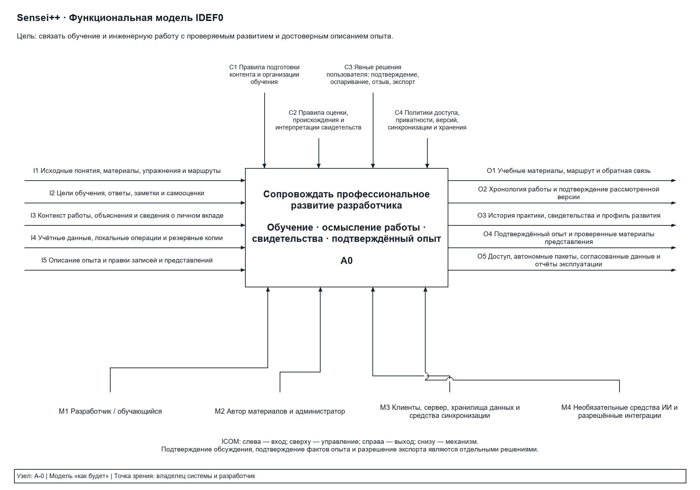
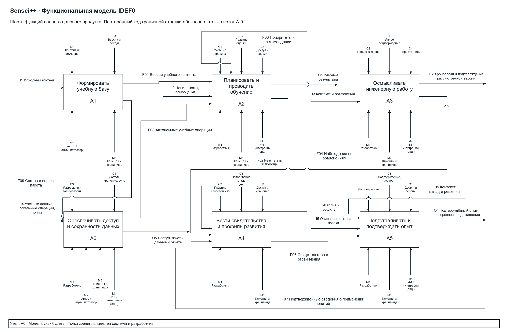

# Функциональные требования и модель IDEF0 информационной системы «Sensei++»

**Основной результат:** [редактируемая функциональная модель .drawio](models/Sensei-IDEF0.drawio).

Модель содержит четыре страницы: «A-0 · Контекст», «A0 · Декомпозиция», «Требования · Покрытие» и «Потоки · Проверка». Первые две страницы образуют два уровня функциональной модели. Последние две являются справочными страницами, а не дополнительными уровнями декомпозиции. Блоки, стрелки, подписи и таблицы сохранены как отдельные редактируемые объекты diagrams.net.

## 1. Постановка задачи и границы модели

**Тип модели:** «как будет». Описывается целевая система по общему видению проекта, без разделения функций на реализованные и будущие.

**Цель моделирования:** показать, как система связывает обучение, осмысление инженерной работы, накопление проверяемых свидетельств и подготовку достоверного описания профессионального опыта.

**Точка зрения:** владелец информационной системы и разработчик, использующий её для собственного профессионального развития.

**Главная бизнес-функция A0:** «Сопровождать профессиональное развитие разработчика». Она объединяет направления Learn, Work и Prove, а не сводится к прохождению упражнений или ведению журнала.

В границы системы входят подготовка учебного контента, учебный цикл, осмысление рабочих эпизодов, ведение свидетельств, подготовка опыта и эксплуатационные функции. Участники, их исходные сведения, организационные правила и технические средства показаны как внешние входы, управления и механизмы. Работа возможна без трудоустройства, подключения репозитория и обязательного использования ИИ. Организационные оценки сотрудников, сертификация квалификации и автоматическое принятие инженерных изменений не являются выходами этой модели.

Основания для модели:

- [Целевой анализ предметной области и требования](12-domain-analysis-and-requirements.md): назначение, роли, функции и требования к надёжности.
- [Исходное видение продукта](inputs/product-brief.md): направления обучения, осмысления работы, профиля, подтверждения и представления опыта.
- [Учебный контракт](09-learning-system.md): предметная независимость, упражнения, сессии, свидетельства, адаптация, интенсивные режимы и автономное обучение.
- [Жизненные циклы и происхождение данных](02-domain-and-lifecycles.md), [пользовательские потоки и интеграции](04-flows-and-integrations.md): версии, отдельные подтверждения, допустимые источники и экспорт.
- Методические требования IDEF0, предоставленные в задании: стороны блока, контекстная диаграмма и ограничение сложности.

## 2. Функциональные требования

Требования описывают действия системы. Правила оценки, приватности и согласованности уточняют выполнение этих действий и представлены управляющими стрелками. Конкретные технологии развёртывания, целевая задержка API и аппаратные характеристики не являются самостоятельными бизнес-функциями.

| Код | Функциональное требование | Блоки A0 |
| --- | --- | --- |
| FR01 | Вести предметно-независимый каталог понятий, их связей и предпосылок. | A1 |
| FR02 | Готовить, проверять, публиковать и деактивировать версии учебного контента. | A1 |
| FR03 | Поддерживать шесть типов упражнений, допустимые ответы и правила проверки. | A1, A2 |
| FR04 | Вести личные цели и маршруты по общим понятиям без дублирования прогресса. | A2 |
| FR05 | Предоставлять материалы и справочные объяснения выбранной темы. | A2 |
| FR06 | Проводить сессии на 3/5/10 заданий; сохранять паузу, пропуск и завершение. | A2 |
| FR07 | Сохранять ответы и помощь; проверять объективные задания; выдавать обратную связь. | A2 |
| FR08 | Поддерживать интенсивную практику, экзаменационный режим и подготовку к интервью. | A2 |
| FR09 | Рекомендовать темы и повторения по целям, свидетельствам и актуальности знаний. | A2, A4 |
| FR10 | Создавать и архивировать рабочие/учебные эпизоды; фиксировать контекст и вклад. | A3 |
| FR11 | Уточнять интерпретацию контекста, обсуждать решения и сохранять открытые вопросы. | A3 |
| FR12 | Записывать явное подтверждение точной рассмотренной версии контекста и обсуждения. | A3 |
| FR13 | Автоматически вести историю, свидетельства и профиль с источниками и условиями. | A4 |
| FR14 | Позволять оспаривать, исправлять и отзывать наблюдения, сохраняя их происхождение. | A4 |
| FR15 | Формировать черновики опыта из активности; разрешать прямое создание и правки. | A5 |
| FR16 | Вести редакции опыта; подтверждать точные факты, вклад и известный результат. | A5 |
| FR17 | Готовить и репетировать рассказ об опыте; экспортировать проверенное представление. | A5 |
| FR18 | Управлять учётными записями, входом, ролями и изоляцией данных владельцев. | A6 |
| FR19 | Управлять разрешением на раскрытие, выгрузкой и удалением личных данных. | A6 |
| FR20 | Загружать пакеты, обучаться без сети и синхронизировать сохранённые результаты. | A1, A2, A6 |
| FR21 | Повторять операции без дублей; выявлять конфликты версий; сохранять принятые данные. | A2, A3, A4, A5, A6 |
| FR22 | Контролировать состояние системы; вести журналы, резервные копии и восстановление. | A6 |
| FR23 | Принимать разрешённый выбранный контекст из интеграций с указанием происхождения. | A3, A6 |
| FR24 | Использовать необязательный ИИ для помощи, интерпретаций и черновиков без автоподтверждения. | A2, A3, A4, A5 |

Шесть типов упражнений FR03: карточка с самооценкой, прогноз результата, выбор ответа, упорядочение, сопоставление и поиск ошибки. Более сложные форматы FR08 расширяют учебный цикл в рамках общего видения. FR17, FR23 и FR24 учитывают представление опыта, разрешённые интеграции и необязательную помощь ИИ; они не означают обязательную зависимость базового обучения от внешних сервисов.

## 3. Контекстная диаграмма A-0

На диаграмме A-0 расположен единственный блок A0. Он преобразует сведения о содержании обучения, деятельности и действиях пользователя в учебные результаты, свидетельства и подтверждённые материалы опыта под управлением правил системы.

| Тип | Код | Поток |
| --- | --- | --- |
| Вход | I1 | Исходные понятия, материалы, упражнения и маршруты. |
| Вход | I2 | Цели обучения, ответы, заметки и самооценки. |
| Вход | I3 | Контекст работы, объяснения и сведения о личном вкладе. |
| Вход | I4 | Учётные данные, локальные операции и резервные копии. |
| Вход | I5 | Описание опыта и правки записей и представлений. |
| Управление | C1 | Правила подготовки контента и организации обучения. |
| Управление | C2 | Правила оценки, происхождения и интерпретации свидетельств. |
| Управление | C3 | Явные решения пользователя: подтверждение, оспаривание, отзыв, экспорт. |
| Управление | C4 | Политики доступа, приватности, версий, синхронизации и хранения. |
| Механизм | M1 | Разработчик / обучающийся. |
| Механизм | M2 | Автор материалов и администратор. |
| Механизм | M3 | Клиенты, сервер, хранилища данных и средства синхронизации. |
| Механизм | M4 | Необязательные средства ИИ и разрешённые интеграции. |
| Выход | O1 | Учебные материалы, маршрут и обратная связь. |
| Выход | O2 | Хронология работы и подтверждение рассмотренной версии. |
| Выход | O3 | История практики, свидетельства и профиль развития. |
| Выход | O4 | Подтверждённый опыт и проверенные материалы представления. |
| Выход | O5 | Доступ, автономные пакеты, согласованные данные и отчёты эксплуатации. |

Входы — сведения, которые функция преобразует. Управления определяют допустимые действия и интерпретацию результата. Поэтому ответ на упражнение относится к I2, а решение подтвердить точную редакцию опыта — к C3. Пользователь как участник процесса является механизмом M1; его сведения и решения показаны отдельными стрелками.

## 4. Модель окружения — декомпозиция A0

Контекстный блок A0 разложен на шесть функций A1–A6. Это функции системы, а не экраны приложения, серверные модули или последовательные шаги обязательного сценария. Обучение и ведение опыта доступны независимо от наличия рабочего эпизода.

| Блок | Функция | Содержание |
| --- | --- | --- |
| A1 | Формировать учебную базу | Автор ведёт понятия и связи, создаёт материалы, задания, ключи проверки и маршруты; система проверяет и публикует версии, исключает дефектный контент из новых сессий, сохраняя исторические версии. |
| A2 | Планировать и проводить обучение | Система сочетает цели пользователя, опубликованный контент и рекомендации; выдаёт материалы, формирует ограниченные сессии, сохраняет ответы и помощь, проверяет задания, поддерживает повторы и интенсивные режимы. Автономные попытки обрабатываются по закреплённым версиям. |
| A3 | Осмысливать инженерную работу | Система сохраняет и архивирует эпизоды, уточняет контекст и его интерпретацию, организует обсуждение решений, сохраняет объяснения, помощь и нерешённые вопросы; фиксирует явное подтверждение рассмотренного набора данных. |
| A4 | Вести свидетельства и профиль развития | Система автоматически связывает результаты и наблюдения с понятиями и источниками, поддерживает историю и профиль, показывает ограничения, учитывает оспаривание и отзыв, формирует объяснимые рекомендации обучения. |
| A5 | Подготавливать и подтверждать опыт | Система предлагает черновик из эпизода и свидетельств либо принимает прямую запись, ведёт редакции, помогает описать личный вклад, сохраняет подтверждение фактов, готовит и позволяет репетировать представление; экспортирует отдельно проверенный материал. |
| A6 | Обеспечивать доступ и сохранность данных | Система обслуживает учётные записи и роли, защищает личные данные, управляет разрешениями, выгрузкой и удалением, собирает автономные пакеты, синхронизирует операции, выявляет конфликты и повторы, ведёт эксплуатационные журналы и резервное восстановление. |

На A0 полные названия внешних потоков местами сокращены для читаемости; их идентичность задаётся кодами I, C, M и O. Повторённые граничные стрелки, например C4 или M3 у нескольких блоков, представляют разветвление одного родительского потока. Они не вводят дополнительных внешних потоков и не являются скрытыми туннелями. Пересечения линий без узла не означают соединения: в предпросмотре они показаны обходом линии.

### 4.1. Основные межфункциональные потоки

| Код | Источник → получатель | Роль у получателя | Содержание |
| --- | --- | --- | --- |
| F01 | A1 → A2 | Вход | Опубликованные версии понятий, материалов, упражнений и маршрутов. |
| F02 | A2 → A4 | Вход | Сохранённые попытки, результаты, самооценки и события помощи. |
| F03 | A4 → A2 | Управление | Приоритеты тем и объяснимые рекомендации повторения; влияют на выбор учебной активности. |
| F04 | A3 → A4 | Вход | Наблюдения по объяснениям и контексту; источники, помощь и открытые вопросы. |
| F05 | A3 → A5 | Вход | Контекст, роль, решения, вклад и подтверждение рассмотренного обсуждения. |
| F06 | A4 → A5 | Вход | Свидетельства и их ограничения для подготовки достоверного описания опыта. |
| F07 | A5 → A4 | Вход | Подтверждённая редакция опыта и сведения о применении понятий. |
| F08 | A6 → A2 | Вход | Авторизованные автономные учебные операции для проверки по закреплённым версиям. |
| F09 | A1 → A6 | Вход | Опубликованный состав и точные версии контента для автономных пакетов. |

### 4.2. Правила движения и преобразования данных

1. **Публикация и версии.** A1 передаёт в A2 и A6 опубликованные версии. Созданная сессия закрепляет версии материалов, упражнений и проверки. Деактивация контента не заменяет содержимое исторических попыток.
2. **Сохранение результатов.** A2 сохраняет ответ, использованные подсказки и результат согласованно до передачи F02. Повторная отправка той же операции возвращает прежний результат без дублирования попытки или свидетельства. Учитываются первые и последующие попытки с указанием помощи.
3. **Самооценка.** Самооценка хранится отдельно от объективного результата. Её положительный вклад ограничен и допускается по одному понятию не чаще раза за 72 часа. Чтение материала и текстовая заметка не создают подтверждённого знания.
4. **Происхождение свидетельств.** A4 различает проверенный ответ, самооценку, применение понятия в работе и интерпретацию ИИ. F07 подтверждает сведения об опыте и применении, но не превращается в доказательство понимания механизма. Профиль показывает основания, помощь и нерешённые вопросы вместо универсального процента владения технологией.
5. **Оспаривание и отзыв.** Решение C3 в A4 меняет состояние наблюдения; исходная попытка и связь с источником сохраняются. Спорные и отозванные свидетельства не используются как активное основание положительных выводов. F03 формируется по допустимым наблюдениям и влияет на следующий учебный выбор.
6. **Раздельные подтверждения.** Подтверждение в A3 относится к точной версии рассмотренного контекста и обсуждения. Оно может сосуществовать с открытыми вопросами и не означает принятие фактов опыта. A5 отдельно сохраняет подтверждение редакции опыта и проверку экспортируемого представления. Изменение содержимого создаёт новую редакцию, требующую собственного решения пользователя.
7. **Автономная работа.** A6 собирает пакеты по F09, сохраняет идентичность операций и передаёт F08 в A2. Клиентские данные проходят авторизацию и предметную проверку; клиент не может непосредственно назначить оценку или заменить профиль A4. Принятые операции и согласованные версии возвращаются пользователю в O5.
8. **Конфликты и восстановление.** C4 требует изоляции владельцев, проверки версий и сохранения принятого результата. Устаревшее изменение не перезаписывает новую редакцию. Локальные несогласованные операции остаются доступными до разрешения конфликта. Резервные копии I4 используются A6 для восстановления; журналы и статус восстановления входят в O5.
9. **Приватность и интеграции.** Выбранный разрешённый контекст поступает в I3. Участник предварительно видит раскрываемые данные и получателя. A6 обеспечивает проверку доступа и разрешений. Экспорт представления O4 не раскрывает автоматически приватную историю ответов; выгрузка собственных данных и их удаление относятся к FR19/A6.
10. **Необязательный ИИ.** M4 помогает с объяснениями, интерпретациями и формулировками. Его предложения сохраняют происхождение и проходят правила C2/C3. Отказ ИИ не означает неверный учебный ответ и не блокирует базовую практику. ИИ и администратор не подтверждают опыт за владельца.

## 5. Проверка соответствия заданию

| Критерий | Результат | Основание |
| --- | --- | --- |
| Основные требования отражены в модели | Выполнен | Матрица FR01–FR24 связывает каждое требование с одним или несколькими блоками. Охвачены обучение, работа, опыт, авторство контента и эксплуатация. |
| Каждой функции соответствует минимум один блок | Выполнен | Каталог и подготовка контента — A1; обучение — A2; осмысление работы — A3; свидетельства и профиль — A4; опыт и представления — A5; доступ и сохранность — A6. |
| Не менее двух уровней | Выполнен | A-0: один блок A0; диаграмма A0: его декомпозиция A1–A6. |
| В модели окружения не менее четырёх блоков | Выполнен | Шесть блоков; одновременно соблюдено ограничение сложности 2–6. |
| Основные потоки и правила движения определены | Выполнен | 18 внешних потоков ICOM, 9 внутренних потоков F01–F09, словарь потоков и десять правил преобразования. |
| Контекст согласован с декомпозицией | Выполнен | I1–I5, C1–C4, M1–M4 и O1–O5 присутствуют на обеих диаграммах; внешних потоков без родительского аналога нет. |
| Стороны блоков соответствуют IDEF0 | Выполнен | Входы слева, выходы справа, управления сверху, механизмы снизу. Внутренний F03 — выход A4, используемый как управление A2. |
| Файл можно редактировать | Выполнен | Сохранён несжатый mxGraph XML: четыре страницы, отдельные блоки, соединения, текстовые объекты и ячейки таблиц. |

Проверены разбор XML, уникальность идентификаторов и ссылки соединений, стороны подключения, баланс внешних потоков, покрытие требований и наличие требований у каждого блока. По сохранённому XML сформированы изображения всех четырёх страниц; проверены размещение текста и читаемость двух основных диаграмм. Проверка относится к документу и модели, а не к работоспособности программной реализации Sensei++.

## 6. Файлы и использование

- [Sensei-IDEF0.drawio](models/Sensei-IDEF0.drawio) — основной редактируемый файл; открыть в diagrams.net через «Файл → Открыть с → Устройство».
- [Контекст A-0](models/previews/context.png) и [декомпозиция A0](models/previews/decomposition.png) — изображения для просмотра и включения в отчёт.
- [Требования и покрытие](models/previews/requirements.png), [потоки и проверка](models/previews/rules.png) — изображения справочных страниц.
- [Генератор модели и предпросмотра](models/generate_idef0.py) — воспроизводит `.drawio` и изображения средствами Python/Pillow, проверяет структуру и текстовое размещение.

При ручном редактировании `.drawio` сохранять изменения в основном файле. Повторный запуск генератора восстанавливает модель из его исходных определений и заменяет ручные изменения файла; изменения для воспроизводимой генерации следует вносить в скрипт.
